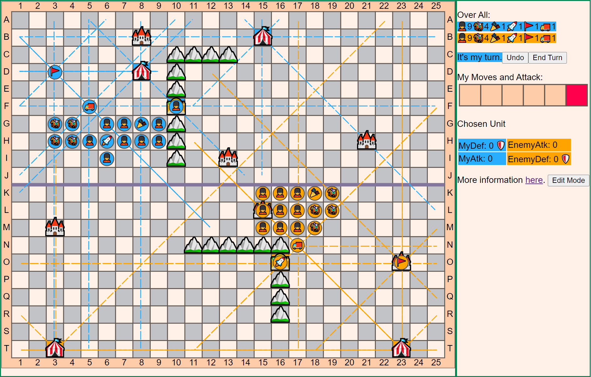
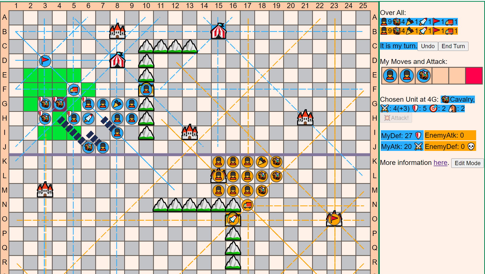
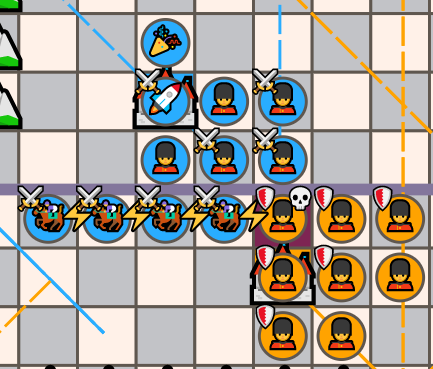
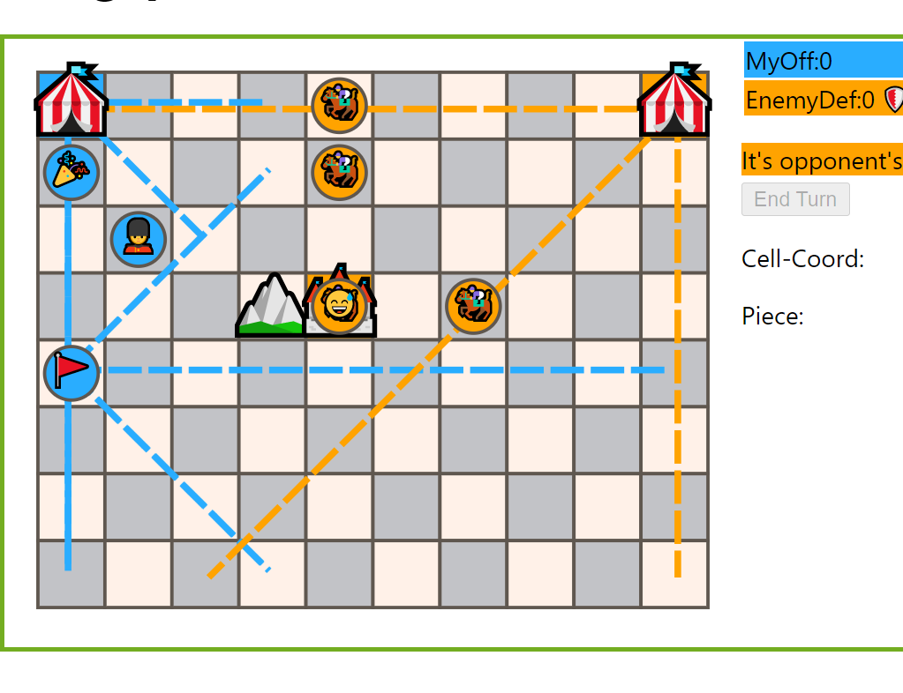
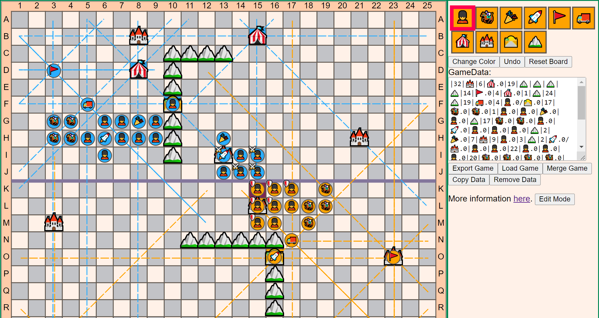

# Le Jeu de la Guerre

A WEB implementation of Guy Debord's A Game of War ([Le Jeu de la Guerre](https://www.wikiwand.com/fr/Le_Jeu_de_la_guerre_(livre))). 

## About the Game

Here are some materials about the game and its history.

- [BGG page](https://boardgamegeek.com/boardgame/27323/le-jeu-de-la-guerre)
- [On Class Wargames](https://www.classwargames.net/?p=1636)
- [Kriegspiel](http://r-s-g.org/kriegspiel/about.php)

### Pieces and Strongholds

Why emoji? there is nothing more appropriate than emoji to illustrate the Spectacle: we are habiting from symbols to symbols that are produced by L'Autre. The big tech companies decide the meanings and the representations of those symbols, whether [🔫](https://emojipedia.org/pistol/) is a handgun or a harmless toy.

- Units
  - 💂 Infantry
  - 🏇 Cavalry
  - 🎉 Artillery
  - 🚀 Swift Artillery
  - 🚩 Relay
  - 🚚 Swift Relay
- Strongholds
  - 🎪 Arsenal
  - 🏰 Fortress
  - 🛣️ Mountain Pass
  - ⛰️ Mountain
- Battle related symbols
  - ⚔️ Attack
  - 🛡️ Defense
  - 🎯 Combat Range
  - 🐴 Move Speed
  - ⚡ Cavalry Charge
  - 🏃‍♂️ Retreat
  - 💀 Captured
  - 😅 Out of Supply
  - 💥 Battle

### Rules

You can also refer to the more detailed [rules](http://r-s-g.org/kriegspiel/rules.php) here.

#### Overall

This game is a simulation of the battle in the Napoleonic Wars. Two armies with a limited amount of units fight on a 25⨉20 board. The game ends by occupying(thus destroying) the enemy's all 🎪Arsenals.

Each player can move up 5 units and attack 1 enemy per turn. The 🐴speed affects the unit's movement range in one turn.

The two main features are **combat** and **supply** settings

Notice "adjacent" in this game means all 8 direction

### Combat

There is no randomness in combat, and combat does not depend on single units. The game stress arranging and cooperating units to achieve high battle factors(i.e. ⚔️Attack and 🛡️Defense), which decide the combat.

Every unit radiates its factor in 米 shape within its 🎯combat range. You can see the units that provide ⚔️Atk and 🛡️Def. The total values are the battle factor at that point. Some strongholds 🏰Fortress and 🛣️Mountain Pass can provide extra defense if they are occupied by 💂Infantry or 🎉🚀Artillery.

To attack an enemy you need to have a higher ⚔️Atk than its 🛡️Def at that point, and if just higher than 1, the enemy has to 🏃‍♂️retreat this unit; otherwise, it will be 💀captured.

#### ⚡Cavalry Charge

Units usually provide higher 🛡️Def than ⚔️Atk, so to break through the enemy's defense, you can use ⚡cavalry charge.

Just let 🏇cavalry be adjacent to the enemy's unit to toggle ⚡charge, and other 🏇cavalries in the direction line also count. When 🏇cavalry is in ⚡charge, its ⚔️Atk becomes 7, so totally you can get up to 28 ⚔️Atk through ⚡charge.

There are also some restrictions about the ⚡charge, such as one can not charge towards the unit in 🏰Fortress or 🛣️Mountain Pass.

### Supply

Units highly rely on supply, the unit 😅out of supply can not move nor provide battle factors. Notice that supply could be cut by the enemy.

The supply originally emitted by 🎪Arsenal, also in 米 shape with unlimited range, except be blocked by enemy's units or ⛰️Mountain. The 🚩🚚relay units can redirect supply lines, and they even can move when they are 😅out of supply.

To be in supply, units must be on supply lines or adjacent to units that are in supply.

### Edit Mode

Currently, the game provides a default opening. But you can customize your own with the editor mode.

You can Save and Load your game with the FEN-like notation. Merge game can add units to the board, which is useful for players to apply their deploy plans.

## The Other Implementation

You can also try the local version on the [GitHub page](https://iamcxds.github.io/kriegspiel).

There is another digital implementation: [Kriegspiel](http://r-s-g.org/kriegspiel/index.php), made by Alex Galloway. There are an [interview](https://www.youtube.com/watch?v=CGjt8po_y4I) and a [playthrough](https://www.youtube.com/watch?v=4l2M6vpWLAw) by Fred Serval. Unfortunately, it's only available on Mac and IOS, which inspires me to make a WEB version.

## The Ambiguities of Rules (my setting)

- Will enemy units block fire lines? i.e. can I attack back-line units? (no, yes)
- Will offline enemy units block communication lines? will the retreating unit do? (no, yes)
- Is failed retreat count as a move? (no)
- Can offline units retreat? (no)